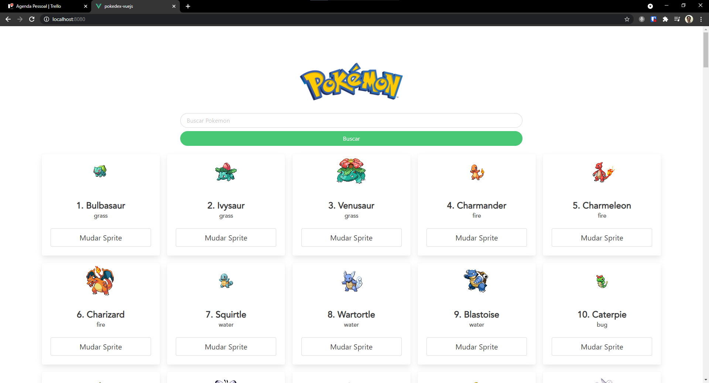

# Pokedex

## ℹ Sobre o Projeto

Feito durante a Formação NodeJS com o intuito de aprender VueJS para criação de aplicações web e consumo de APIs.

Nesse caso, a API consumida foi a PokeAPI para criação de uma Pokedex

## 🛠 Tecnologias

- VueJS
- Axios
- Bulma

## 🌐 Resultado

<a href="https://pokedex-vuejs-kappa.vercel.app/">
  
</a>

Clique na imagem para abrir o site utilizando o Vercel!

## 🤔 Como executar o Projeto? 

### Requisitos

- NPM ou Yarn
- Vue

### Rodando

```bash
# Instação de dependências
$ yarn install

# Executando projeto
$ yarn serve
```